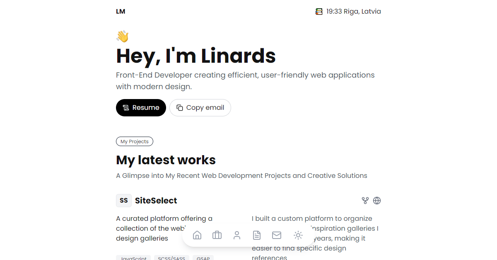

# Personal Portfolio Website

A responsive personal portfolio built with **Next.js 15** (App Router) and **React 19**. It showcases projects, skills and background, and is tuned for a 100/100/100/100 Lighthouse score and full keyboard / screen-reader accessibility.

## Features

-   Responsive design, dark mode (system preference + toggle, applied before first paint)
-   Project cards with hover video previews and detailed, statically generated project pages
-   Physics-based skill visualisation (Matter.js) with a plain-list fallback for reduced motion and assistive tech
-   Floating navigation bar, Riga local time and "currently doing" indicator
-   Copy-to-clipboard email with confetti

## Tech

Next.js, React, TypeScript, Tailwind CSS, Matter.js, lucide-react / react-icons, Playwright, Lighthouse CI.

## Scripts

| Command              | What it does                                                 |
| -------------------- | ------------------------------------------------------------ |
| `npm run dev`        | Development server                                           |
| `npm run build`      | Production build                                             |
| `npm run lint`       | ESLint incl. `jsx-a11y/recommended`                          |
| `npm run typecheck`  | `tsc --noEmit`                                               |
| `npm test`           | Playwright: smoke tests plus axe accessibility checks       |
| `npm run lighthouse` | Lighthouse CI against a production build (`lighthouserc.json`) |

Set `NEXT_PUBLIC_GA_MEASUREMENT_ID` to enable Google Analytics; it is skipped when unset.

